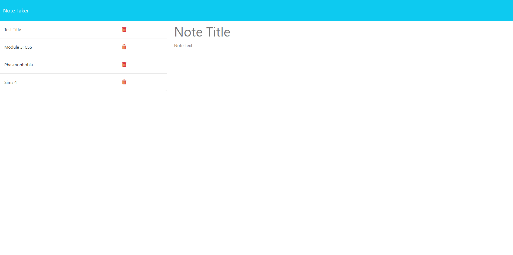

# Express.js : Note Taker App 

## Description
The Note Taker is an application that allows a user to take notes/submit reminders to themselves via an online website. Users will be able to Give the note a title, write however much they desire, and then save the note. Users will also be able to see past notes in the side bar to the left, and can delete notes that they no longer need. 

## Installation 
As this application is rendered on a web browser, all a user needs to do is click on the link to be directed to the application. However, if you wish to take a look at the code, it's recommended that you have `Node.js` installed on to your device. Once it's installed, you can copy this repository on to your own device and open it up in a program like Visual Code Studio. 

Opening the terminal under the **main folder** of the repository, run the commands `npm install` and `node server.js` to view the code in a local host tab. As this application runs with npm packages, an install is a must for it to function properly.

## Visuals
Here are a couple of screenshots of the main page of the application and the note portion of the application:

This is the link to the deployed Heroku application:
<a href="https://awkward-aardvark-708e07f4b9d7.herokuapp.com/">Note Taker Application</a>

## Support
If something at all breaks in the code, please don't hesitate at all to contact me here on GitHub or via my email `Leesamarie95@gmail.com`. I'm always willing to lend a hand if I can.

## License
Copyright (c) 2024 LeesaM95

Permission is hereby granted, free of charge, to any person obtaining a copy
of this software and associated documentation files (the "Software"), to deal
in the Software without restriction, including without limitation the rights
to use, copy, modify, merge, publish, distribute, sublicense, and/or sell
copies of the Software, and to permit persons to whom the Software is
furnished to do so, subject to the following conditions:

The above copyright notice and this permission notice shall be included in all
copies or substantial portions of the Software.

## Acknowledgments
As always, a big thanks to my peers, my teachers, and the boat load of repositories I snooped through to get an idea of where I went wrong. I truly appreciate every single one I browsed through, otherwise I may have just yanked out all of my hair and called it a day. I'm forever grateful of all the past students and wonderful coders still keeping their projects up for novice coders like myself to look through for clarity. 